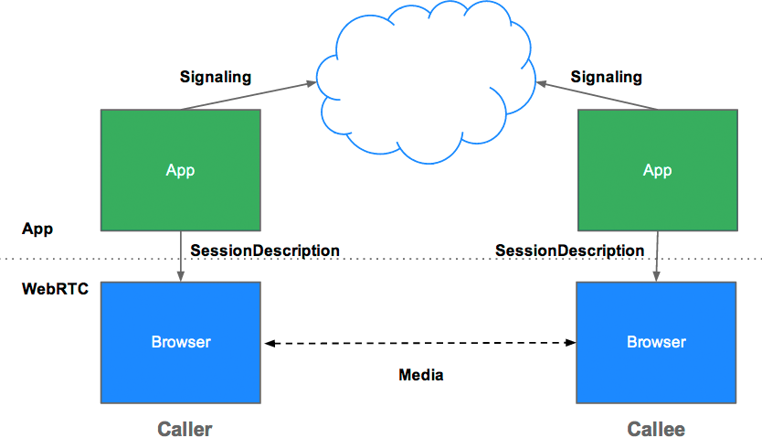

title: WebRTC
author:
  name: Olivier Wietrich
  twitter: bredeleca
  github: bredele
  url: http://github.com/bredele
theme: theme
output: index.html
controls: false

--

# WebRTC
## Plugin-free real time communication
<div class="center">
	github [bredele](http://github.com/bredele)
	twitter [bredeleca](https://twitter.com/bredeleca)
</div>
--
## I was bored...


<div class="center pic">
	
</div>
## ...and I like simple things!
--

<div class="vertical">
	Low latency and high quality **audio**, **video and data** communication
</div>

--
### APIs

* MediaStream (getUserMedia)
* RTCPeerConnection
* RTCDataChannel

### Standards and Protocols

* SDP
* SIP, PSTN, STUN, TURN, ICE

--
### Support?

* Google Chrome (desktop and Android)
* Mozilla Firefox stable
* Opera stable

--
### MediaStream

```javascript
navigator.getUserMedia = navigator.getUserMedia ||
  navigator.webkitGetUserMedia || navigator.mozGetUserMedia;

var constraints = {video: true};

function successCallback(localMediaStream) {
  var video = document.querySelector("video");
  video.src = window.URL.createObjectURL(localMediaStream);
}

function errorCallback(error){
  console.log("navigator.getUserMedia error: ", error);
}

navigator.getUserMedia(constraints, successCallback, errorCallback);
```

[demo](./examples/media.html)

--
### Multiple inputs

* Microphones
* Front/Rear Camera
* Screen

### Constraints

* Video/Audio/Screen
* Resolution
* Frame rate
* etc

--
### Some cool stuff

  - [mocowe](http://lli.web.fh-koeln.de/mocowe/#1)
  - [ascii](http://idevelop.ro/ascii-camera/)
  - [camtoy](http://webcamtoy.com/)
  - [xylophone](http://www.soundstep.com/blog/experiments/jsdetection/)
--
### Signaling 

  Peer to peer...but we still need servers!



--
### SDP

```
v=0
o=- 3883943731 1 IN IP4 127.0.0.1
s=
t=0 0
a=group:BUNDLE audio video
m=audio 1 RTP/SAVPF 103 104 0 8 106 105 13 126

// ...

a=ssrc:2223794119 label:H4fjnMzxy3dPIgQ7HxuCTLb4wLLLeRHnFxh810
```
--
### STUN, TURN and ICE


--
### Some libraries

  - [sharefest](https://www.sharefest.me/)
  - [peerjs](http://peerjs.com/)
  - [rtcio](http://rtc.io)

--

### And my projects

A modular and composable peer connection:
  - **[peer](http://github.com/bredele/peer)**

Here's a list of available plugins and codec for peer:
  - **[connect](http://github.com/bredele/connect)** creates local peer-to-peer connection
  - **[channel](http://github.com/bredele/channel)** send data through a peer connection
  - **[signal](http://github.com/bredele/signal)** creates remote peer-to-peer connection
  - **[video](http://github.com/bredele/video)** attach video stream to a peer-to-peer connection

--
Here's a list of available codecs:
  - **[rate](http://github.com/bredele/rate)** changes data channel speed/rate limitation
  - **[opus](http://github.com/bredele/opus)** set opus as preferred audio codec

Related projects:
  - **[hangout](http://github.com/bredele/hangout)** peer-to-peer video through localtunnel

